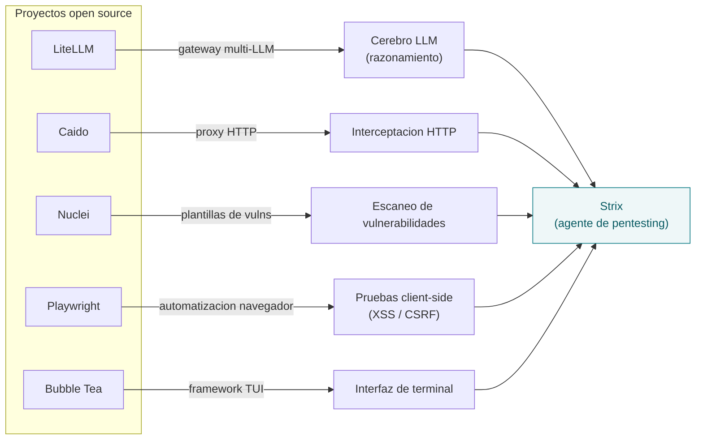
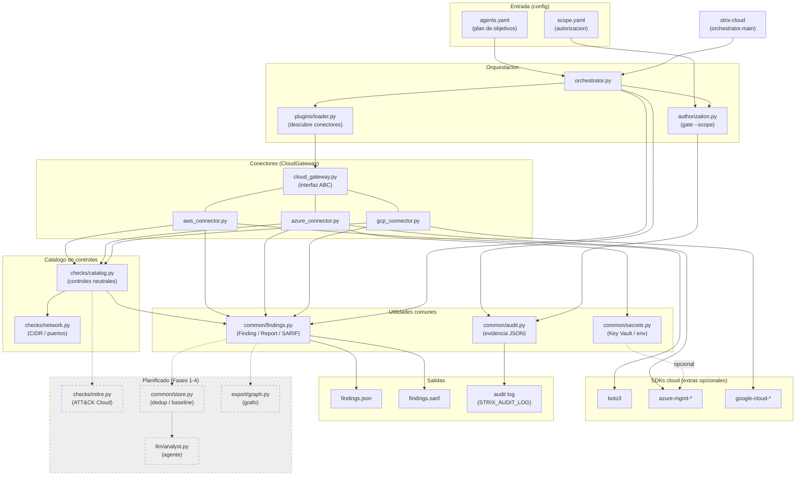
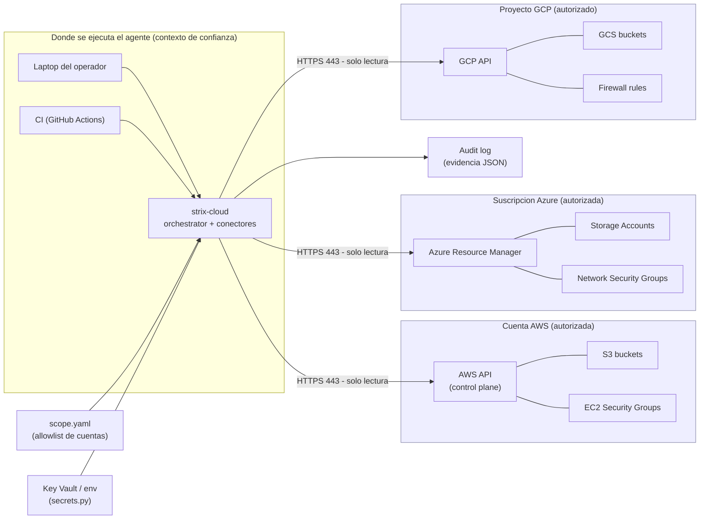
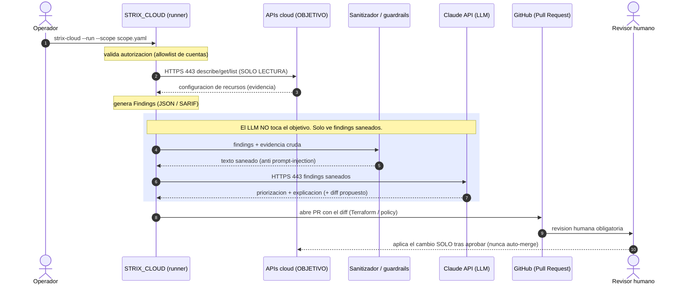

# STRIX_CLOUD

> Fork orientado a **seguridad cloud (CSPM)** para pruebas autorizadas: audita configuraciones de **AWS / Azure / GCP** en **solo lectura** y reporta hallazgos neutrales por proveedor (**JSON + SARIF**).

[](https://github.com/BerriAI/litellm)
[](https://github.com/caido/caido)
[](https://github.com/projectdiscovery/nuclei)
[](https://github.com/microsoft/playwright)
[](https://github.com/charmbracelet/bubbletea)

> ⚠️ **Solo para pruebas autorizadas.** Ejecutar checks reales (`--run`) exige un fichero de autorización (`--scope`). Ver [docs/LEGAL.md](docs/LEGAL.md) y [docs/ETHICS.md](docs/ETHICS.md).

---

## En qué se basa (stack)

STRIX_CLOUD es un fork de [Strix](https://github.com/usestrix/strix) (Apache-2.0). El toolkit de Strix se apoya en excelentes proyectos open source; el diagrama muestra qué capacidad cubre cada uno (Strix los integra, no copia su código):



Detalle y licencias: [wiki/Credits.md](wiki/Credits.md).

## Arquitectura y dependencias

Del plan y la autorización al catálogo de controles, los conectores y la exportación JSON/SARIF. Las cajas discontinuas son la evolución planificada (Fases 1-4).



Detalle: [wiki/Architecture.md](wiki/Architecture.md).

## Agentes y entornos

El mismo binario corre en laptop o CI y habla con AWS/Azure/GCP **solo por HTTPS de lectura**, acotado por el `scope` (allowlist de cuentas) y las credenciales.



Detalle: [wiki/Agents.md](wiki/Agents.md).

## Red: cómo la API/LLM interactúa con el objetivo

Frontera clave: **el LLM nunca tiene ruta de red al objetivo**. Solo el runner habla con el objetivo (lectura); el LLM ve *findings saneados*; la remediación pasa por un PR con revisión humana (nunca auto-merge).



Detalle: [wiki/Network.md](wiki/Network.md).

---

## Motor de hallazgos (CSPM)

Los conectores ejecutan checks de seguridad **read-only** y reportan hallazgos neutrales por proveedor (mismos controles en AWS, Azure y GCP). Ejemplo:

```bash
strix-cloud examples/agents.yaml --run --scope examples/scope.yaml --security \
  --report findings.json --sarif findings.sarif --fail-on HIGH
```

Ver [docs/FINDINGS.md](docs/FINDINGS.md) para el catálogo de controles y [examples/scope.yaml](examples/scope.yaml) para el formato del fichero de autorización.

## Instalación

```bash
git clone https://github.com/YOUR_USERNAME/STRIX_CLOUD.git
cd STRIX_CLOUD

pip install -e .[dev]                 # solo desarrollo/tests
pip install -e .[dev,aws,azure,gcp]   # con los SDKs cloud para ejecutar checks
```

Esto expone el comando de consola `strix-cloud`. Uso rápido:

```bash
strix-cloud examples/agents.yaml                                   # dry-run (sin autorización)
strix-cloud examples/agents.yaml --run --scope examples/scope.yaml # ejecución real (con autorización)
```

## Roadmap

- [x] Interfaz `CloudGateway`, loader de plugins y conectores AWS/Azure/GCP.
- [x] Motor de hallazgos (`Finding`/`Report`) con export JSON y SARIF.
- [x] Catálogo de controles neutral + checks de storage y red en los 3 proveedores.
- [x] **Fase 0**: paquete instalable (`strix-cloud`), CI sin `SKIP_TESTS`, audit JSON a fichero y gating de autorización (`--scope`).
- [ ] **Fase 1**: findings enriquecidos (OCSF-lite + MITRE ATT&CK), persistencia y baseline.
- [ ] **Fase 2**: ampliar controles (IAM, cómputo público, cifrado, logging) + multi-región AWS.
- [ ] **Fase 3-4**: capa de agente LLM (analista) y auto-remediación vía PR.

## Aviso legal y ético

Estos recursos son para investigación y **pruebas autorizadas únicamente**. NO ejecutes ningún agente contra sistemas sin autorización escrita. Consulta [docs/LEGAL.md](docs/LEGAL.md) y [docs/ETHICS.md](docs/ETHICS.md) antes de operar.

## Créditos

Gracias a los mantenedores de [LiteLLM](https://github.com/BerriAI/litellm), [Caido](https://github.com/caido/caido), [Nuclei](https://github.com/projectdiscovery/nuclei), [Playwright](https://github.com/microsoft/playwright) y [Bubble Tea](https://github.com/charmbracelet/bubbletea), y al proyecto [Strix](https://github.com/usestrix/strix). Ver [wiki/Credits.md](wiki/Credits.md).

## Contribuir

1. Trabaja sobre `main` (rama única del proyecto).
2. Añade tests y documentación para cambios relevantes.
3. Referencia cualquier autorización/legal si introduces funcionalidades de prueba.
