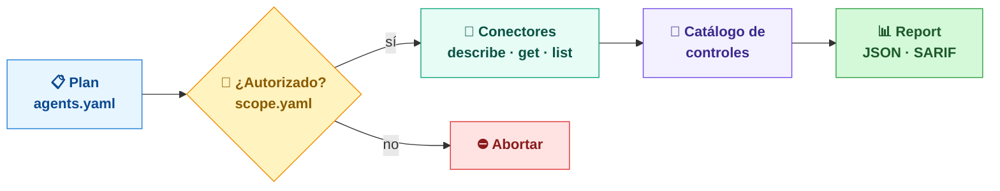

# STRIX_CLOUD

> **Seguridad cloud (CSPM) para pruebas autorizadas.** Audita configuraciones de **AWS · Azure · GCP** en **solo lectura** y reporta hallazgos por severidad en **JSON + SARIF**.

[](https://github.com/BerriAI/litellm)
[](https://github.com/caido/caido)
[](https://github.com/projectdiscovery/nuclei)
[](https://github.com/microsoft/playwright)
[](https://github.com/charmbracelet/bubbletea)

> ⚠️ **Solo para pruebas autorizadas.** Ejecutar checks reales (`--run`) exige un fichero de autorización (`--scope`). Ver [docs/LEGAL.md](docs/LEGAL.md) y [docs/ETHICS.md](docs/ETHICS.md).

---

## 🔭 De un vistazo

```mermaid
flowchart LR
  subgraph CLOUD["☁️ Tu entorno cloud · autorizado"]
    direction TB
    AWS["AWS"]:::aws
    AZ["Azure"]:::az
    GCP["GCP"]:::gcp
  end

  STRIX(["🦉 STRIX_CLOUD<br/>escaneo read-only"]):::strix

  subgraph FIND["🔎 Hallazgos por severidad"]
    direction TB
    C["🔴 CRÍTICO"]:::crit
    H["🟠 ALTO"]:::high
    M["🟡 MEDIO"]:::med
    L["🟢 BAJO"]:::low
  end

  OUT["📄 JSON + SARIF"]:::out

  CLOUD -->|"solo lectura"| STRIX --> FIND --> OUT

  classDef aws fill:#FF9900,stroke:#b36b00,color:#1a1a1a,font-weight:bold;
  classDef az fill:#0078D4,stroke:#004e8c,color:#ffffff,font-weight:bold;
  classDef gcp fill:#34A853,stroke:#1e7e34,color:#ffffff,font-weight:bold;
  classDef strix fill:#0E7C86,stroke:#083f45,color:#ffffff,font-weight:bold;
  classDef crit fill:#B3261E,stroke:#7d1a15,color:#ffffff;
  classDef high fill:#E8590C,stroke:#a53f08,color:#ffffff;
  classDef med fill:#F0A800,stroke:#b37e00,color:#1a1a1a;
  classDef low fill:#2F9E44,stroke:#1e6b2e,color:#ffffff;
  classDef out fill:#5F3DC4,stroke:#3f2888,color:#ffffff;
```



Escanea tus cuentas cloud **sin tocar nada** (solo APIs de lectura), clasifica los problemas de configuración por severidad y te da un informe portable.

## ⚙️ Cómo funciona



Un **gate de autorización** (`scope.yaml`, allowlist de cuentas) decide si el escaneo puede ejecutarse: si el objetivo no está autorizado, aborta antes de la primera llamada.

## 📚 En qué se basa (stack)

Fork de [Strix](https://github.com/usestrix/strix) (Apache-2.0), que se apoya en
[LiteLLM](https://github.com/BerriAI/litellm), [Caido](https://github.com/caido/caido),
[Nuclei](https://github.com/projectdiscovery/nuclei), [Playwright](https://github.com/microsoft/playwright)
y [Bubble Tea](https://github.com/charmbracelet/bubbletea). Qué aporta cada uno y licencias:
[wiki/Credits.md](wiki/Credits.md).

## 🛠️ Instalación y uso

```bash
git clone https://github.com/juank3r/STRIX_CLOUD.git
cd STRIX_CLOUD

pip install -e .[dev]                 # desarrollo/tests
pip install -e .[dev,aws,azure,gcp]   # con los SDKs cloud para ejecutar checks
```

Esto expone el comando de consola `strix-cloud`:

```bash
strix-cloud examples/agents.yaml                                   # dry-run (sin autorización)
strix-cloud examples/agents.yaml --run --scope examples/scope.yaml --security \
  --report findings.json --sarif findings.sarif --fail-on HIGH     # ejecución real
```

Catálogo de controles: [docs/FINDINGS.md](docs/FINDINGS.md) · formato del scope: [examples/scope.yaml](examples/scope.yaml).

## 🗺️ Diagramas detallados

Esquemas técnicos completos en la wiki:

- [Arquitectura y dependencias](wiki/Architecture.md)
- [Agentes y entornos](wiki/Agents.md)
- [Red: cómo la API/LLM interactúa con el objetivo](wiki/Network.md)
- [Créditos y stack](wiki/Credits.md)

## ✅ Roadmap

- [x] Interfaz `CloudGateway`, loader de plugins y conectores AWS/Azure/GCP.
- [x] Motor de hallazgos (`Finding`/`Report`) con export JSON y SARIF.
- [x] Catálogo de controles neutral + checks de storage y red en los 3 proveedores.
- [x] **Fase 0**: paquete instalable (`strix-cloud`), CI verde, audit JSON a fichero y gating de autorización (`--scope`).
- [ ] **Fase 1**: findings enriquecidos (OCSF-lite + MITRE ATT&CK), persistencia y baseline.
- [ ] **Fase 2**: ampliar controles (IAM, cómputo público, cifrado, logging) + multi-región AWS.
- [ ] **Fase 3-4**: capa de agente LLM (analista) y auto-remediación vía PR.

## ⚖️ Aviso legal y ético

Recursos para investigación y **pruebas autorizadas únicamente**. NO ejecutes ningún agente contra sistemas sin autorización escrita. Consulta [docs/LEGAL.md](docs/LEGAL.md) y [docs/ETHICS.md](docs/ETHICS.md) antes de operar.

## 🙌 Créditos

Gracias a los mantenedores de LiteLLM, Caido, Nuclei, Playwright y Bubble Tea, y al proyecto [Strix](https://github.com/usestrix/strix). Detalle en [wiki/Credits.md](wiki/Credits.md).

## 🤝 Contribuir

1. Trabaja sobre `main` (rama única del proyecto).
2. Añade tests y documentación para cambios relevantes.
3. Referencia cualquier autorización/legal si introduces funcionalidades de prueba.
