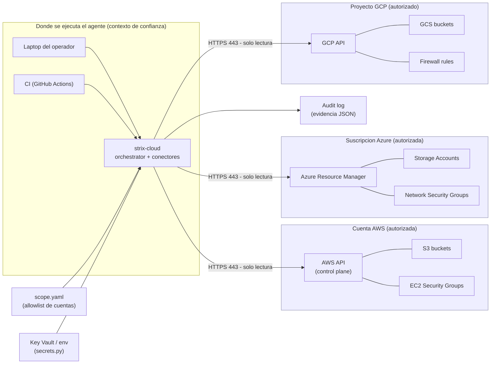

# Agents

Este repositorio contiene plantillas de agentes orientadas a pruebas autorizadas en entornos cloud.

Estructura recomendada:

- `agents/<language>_agent/` — código del agente, `README.md`, `requirements.txt` o `package.json`.
- `agents/common/` — utilidades compartidas, logging, wrappers seguros.

Plantilla mínima (Python):

- `agent.py` — entrypoint que valida permisos y registra acciones.
- `requirements.txt` — dependencias.
- `README.md` — instrucciones de uso y límites.

Recuerda: todos los agentes deben comprobar siempre que disponen de autorización antes de actuar.

## Cómo interactúan los agentes con los entornos

El agente (el orquestador + los conectores) **se ejecuta en un contexto de
confianza** (la laptop del operador o un runner de CI) y se comunica con cada
entorno objetivo **solo por HTTPS y solo con lecturas** (`describe/get/list`).
Dos controles acotan lo que puede tocar: el fichero de **scope** (allowlist de
cuentas autorizadas) y los **secretos** de acceso (Key Vault o variables de
entorno). Cada acción queda registrada en el **audit log** como evidencia.

### Puntos clave

- **El mismo binario** (`strix-cloud`) se ejecuta igual en local o en CI; lo que
  cambia es dónde vive (contexto de confianza), no cómo habla con el objetivo.
- **La frontera con el objetivo es de solo lectura**: los conectores nunca
  escriben ni ejecutan acciones destructivas.
- **El scope decide qué entornos se alcanzan**: una cuenta/suscripción/proyecto
  que no esté en la allowlist aborta la ejecución antes de la primera llamada.
- Autenticación por proveedor: Service Principal (Azure), credenciales/rol (AWS),
  Application Default Credentials (GCP). Los secretos se resuelven vía `secrets.py`.

Ver también: [Arquitectura y dependencias](Architecture) · [Red: API/LLM y objetivo](Network).
