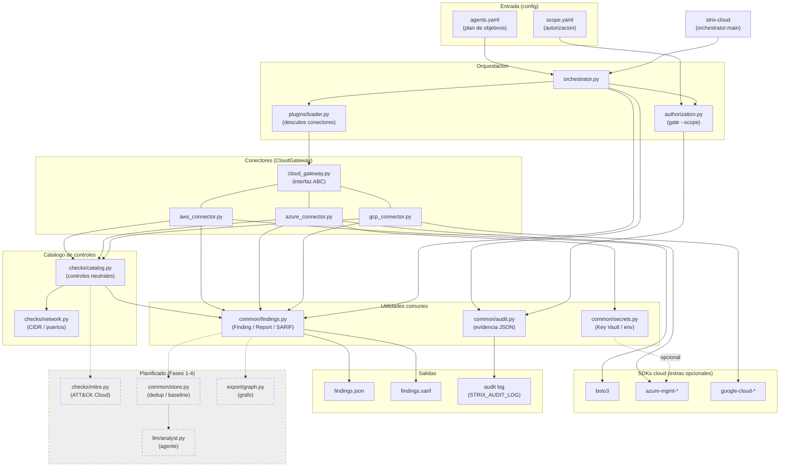

# Arquitectura y dependencias

Esta página explica cómo encajan las piezas de `STRIX_CLOUD` y qué depende de qué.

Hoy el proyecto es un **CSPM determinista read-only**: lee un plan de objetivos,
comprueba la autorización, descubre conectores, ejecuta checks de seguridad (solo
APIs `describe/get/list`) y agrega los hallazgos en un `Report` que se exporta a
JSON y SARIF. Las cajas en **línea discontinua** son la evolución planificada
(Fases 1-4 del roadmap: MITRE, persistencia, agente LLM y grafo).

## Cómo leerlo

- **`orchestrator.py`** es el centro: recibe el `plan` (`agents.yaml`), obliga a la
  **autorización** (`authorization.py` con `scope.yaml`) y usa el **loader** para
  instanciar el conector correcto.
- Todos los conectores implementan la interfaz **`CloudGateway`** (`cloud_gateway.py`):
  `validate_permissions` / `list_resources` / `run_safe_check` / `run_security_checks`.
- Los conectores traducen el **catálogo neutral de controles** (`checks/catalog.py`)
  a llamadas concretas del SDK del proveedor y devuelven objetos **`Finding`**.
- El **`Report`** (`common/findings.py`) agrega los findings y los exporta a **JSON**
  y **SARIF 2.1.0** (consumible por GitHub code scanning).
- La **auditoría** (`common/audit.py`) escribe evidencia JSON; los **secretos**
  (`common/secrets.py`) se resuelven desde Key Vault o variables de entorno.

## Dependencias externas

- **Runtime:** `PyYAML` (parseo del plan y del scope).
- **Extras por proveedor** (`pip install -e .[aws|azure|gcp]`): `boto3`,
  `azure-mgmt-*` / `azure-identity` / `azure-keyvault-secrets`, `google-cloud-*`.
  Son opcionales: sin ellos el conector correspondiente degrada con un aviso.

Ver también: [Agentes y entornos](Agents) · [Red: API/LLM y objetivo](Network).
