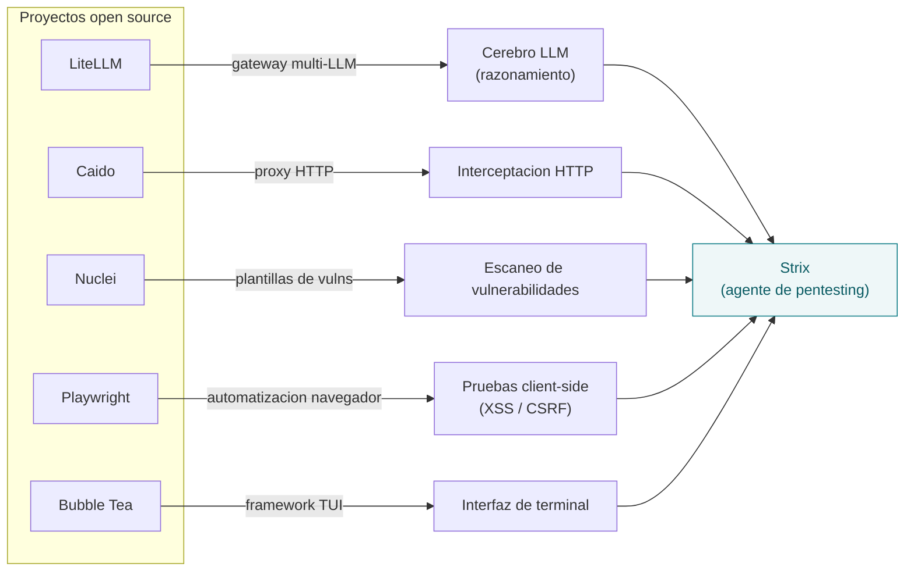

# Créditos y stack open source

STRIX_CLOUD es un fork del proyecto **Strix** ([usestrix/strix](https://github.com/usestrix/strix), Apache-2.0).
Strix, a su vez, se apoya en el trabajo de proyectos open source excelentes. Esta
página reconoce ese stack y enlaza a los repos originales.

> "Strix builds on the incredible work of open-source projects like LiteLLM,
> Caido, Nuclei, Playwright, and Bubble Tea. Huge thanks to their maintainers!"

## Qué aporta cada proyecto

El diagrama muestra qué capacidad de Strix cubre cada dependencia (Strix las
integra; no copia su código).

## Proyectos, rol y licencia

| Proyecto | Qué aporta | Licencia | Repositorio |
|----------|-----------|----------|-------------|
| **LiteLLM** | Gateway/SDK unificado: llama a 100+ LLMs (OpenAI, Anthropic, Gemini, Bedrock, Ollama…) con una sola interfaz | MIT | [BerriAI/litellm](https://github.com/BerriAI/litellm) |
| **Caido** | Toolkit de auditoría web / proxy de interceptación HTTP (alternativa ligera a Burp) | Freemium (código fuente disponible; SDK de plugins abierto en [caidooss](https://github.com/caidooss)) | [caido/caido](https://github.com/caido/caido) |
| **Nuclei** | Escáner de vulnerabilidades rápido basado en plantillas YAML (ProjectDiscovery) | MIT | [projectdiscovery/nuclei](https://github.com/projectdiscovery/nuclei) |
| **Playwright** | Automatización de navegadores para pruebas client-side (Microsoft) | Apache-2.0 | [microsoft/playwright](https://github.com/microsoft/playwright) |
| **Bubble Tea** | Framework TUI en Go para la interfaz de terminal (Charm) | MIT | [charmbracelet/bubbletea](https://github.com/charmbracelet/bubbletea) |

## Cómo se relaciona con STRIX_CLOUD

STRIX_CLOUD hoy es un **CSPM determinista** (auditoría de configuración cloud) y
todavía no integra este toolkit ofensivo. El mapeo previsto es:

- **Capa LLM (Fases 3-4):** LiteLLM o la **API de Claude** directa para el agente
  analista/remediador.
- **Toolkit ofensivo (Caido / Nuclei / Playwright):** aplica al pentesting de
  *aplicaciones*; en la variante cloud es material para módulos futuros, no para
  el CSPM de configuración.
- **Bubble Tea:** referencia para una posible TUI de STRIX_CLOUD.

> Las marcas y logotipos pertenecen a sus respectivos dueños; se muestran aquí
> únicamente con fines de atribución.

Ver también: [Arquitectura](Architecture) · [Agentes y entornos](Agents) · [Red](Network).
