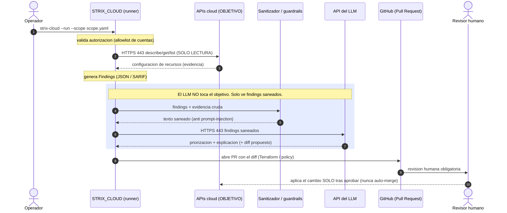

# Red: cómo la API/LLM interactúa con el objetivo

Esta página explica el **flujo de red** de extremo a extremo y, sobre todo, la
**frontera de confianza** más importante del diseño:

> El LLM (una API externa) **nunca** tiene ruta de red al entorno auditado. Solo el
> runner de STRIX_CLOUD habla con el objetivo, **en solo lectura**, y el LLM
> únicamente recibe *findings saneados*. La remediación no se auto-aplica: pasa
> por un Pull Request con revisión humana.

Los pasos **1-4** (CSPM read-only) son lo implementado hoy. Los pasos con el
**LLM** y el **PR** (recuadro azul y siguientes) son el diseño de las Fases 3-4
del roadmap.

## Fronteras y notas de seguridad

- **Todo el tráfico saliente es HTTPS (443)**: tanto hacia las APIs cloud como
  hacia la API del LLM. No se abren puertos entrantes ni se despliega nada en el
  objetivo.
- **Solo lectura contra el objetivo**: los conectores usan exclusivamente APIs
  `describe/get/list`. No hay explotación activa ni acciones destructivas (eso lo
  diferencia del Strix original, que sí valida con PoC).
- **El LLM está aislado del objetivo**: no recibe credenciales ni acceso de red al
  entorno; solo procesa *findings ya saneados*. El sanitizador (guardrails) filtra
  el texto que entra al prompt para evitar *prompt-injection* desde metadatos de la
  cuenta auditada (nombres de recurso, tags, descripciones).
- **Remediación con humano en el bucle**: cualquier cambio propuesto por el LLM se
  materializa como **Pull Request** validado por tests y por un revisor. **Nunca
  hay auto-merge** ni escritura directa del agente sobre la infraestructura.
- **Autorización previa**: el `scope.yaml` limita qué cuentas se pueden alcanzar y
  registra quién autorizó la auditoría (`authorization.granted` / `denied`).

## Qué corre dónde (resumen de red)

| Origen                     | Destino                    | Protocolo | Sentido        | Datos                          |
|----------------------------|----------------------------|-----------|----------------|--------------------------------|
| STRIX_CLOUD (runner)       | APIs cloud del objetivo    | HTTPS 443 | solo lectura   | describe/get/list → evidencia  |
| STRIX_CLOUD (runner)       | API del LLM           | HTTPS 443 | envío/recepción| findings **saneados**          |
| STRIX_CLOUD (runner)       | GitHub (PR)                | HTTPS 443 | escritura PR   | diff de remediación propuesto  |
| Revisor humano             | Infraestructura objetivo   | vía CI/CD | escritura      | cambio aplicado tras aprobar   |

Ver también: [Arquitectura y dependencias](Architecture) · [Agentes y entornos](Agents) · [Ética](Ethics).
